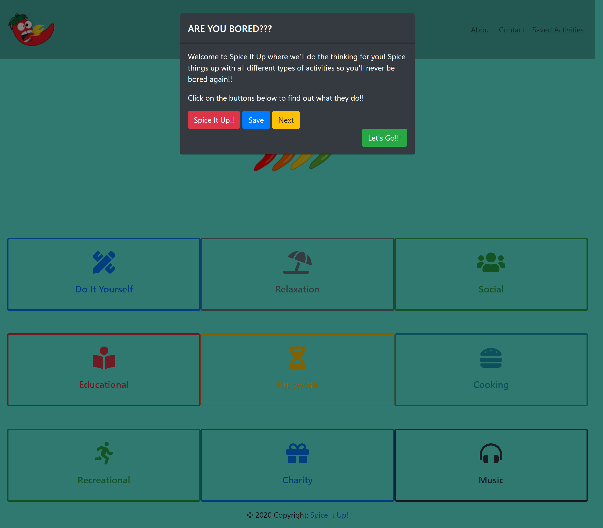
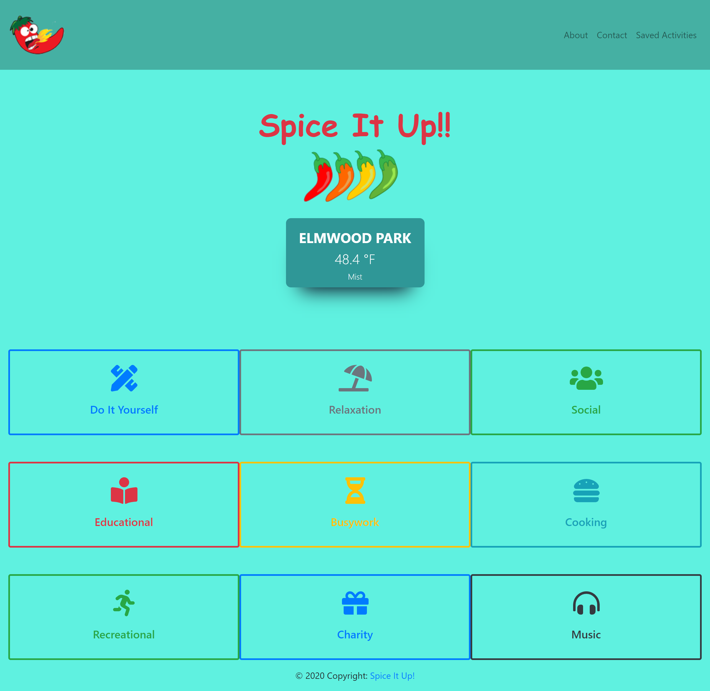
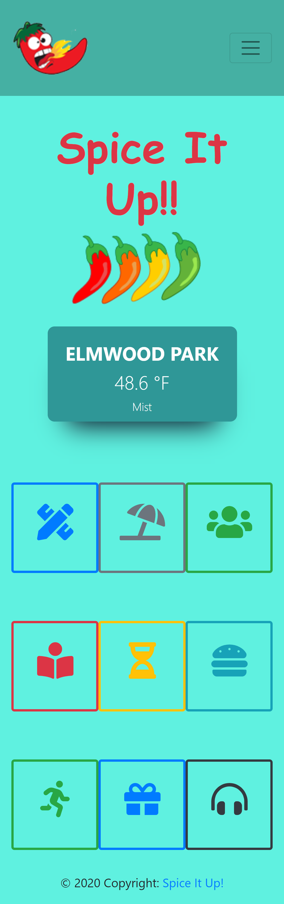
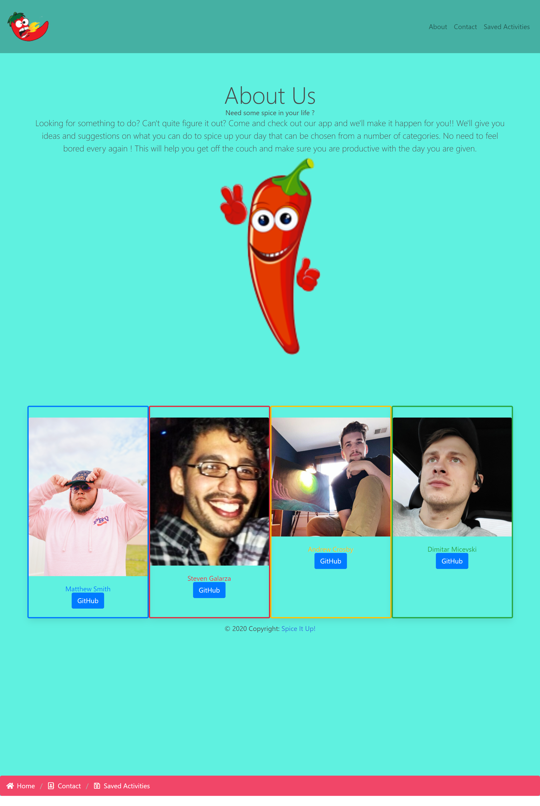
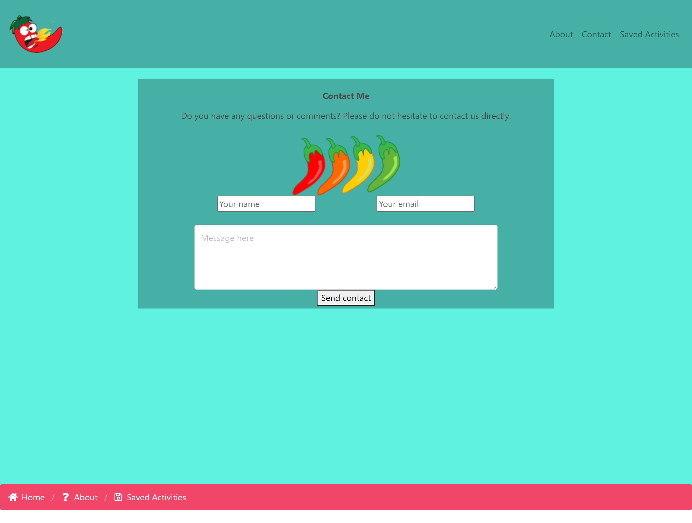
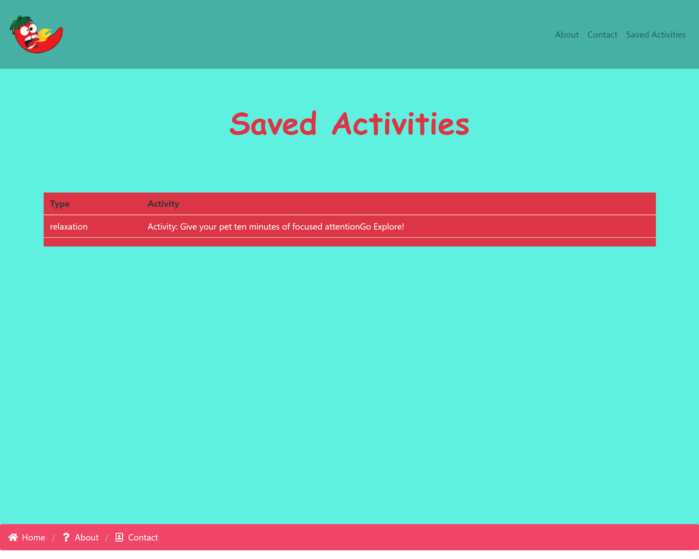

# Project1Group2

## Overview

Welcome to Project 1! This is an important step in your full-stack journey as you will now use your newly acquired skills and knowledge to build web application from scratch. With your team, you will conceive and execute a design that solves a real-world problem by integrating data received from multiple server-side API requests. Because you will be working collaboratively, you will learn agile development methodologies and implement feature and bug fixes using the git branch workflow and pull requests.

**Key Topics**
* Server-side APIs
* Git branching workflow
* Agile software development

## Project Title

**Spice It Up!!!** 

## Project Description

Slogan: **Need some spice in your life???** 

With our project we have decided to make an app that will help the user fight boredom. The app will provide the user with suggestions on activities they can do from a number of categories. The categories will include DIY activities, relaxation activities, social activities, educational activities, busywork, cooking activities, recreational activities, charitable activities, and music suggestions for you to listen to. We will create a random activity generator that will sort through all the activities from each category individually so that if the user already has a certain idea of what they want to do they can chose the specific category and be given a random activity from there. 

The user will have three options once an activity is generated Spice It Up, Save, and Next. With Spice It Up it will mean they have chosen to go with that activity, with Save it means they will save it for a later time, and with Next it means they didn't like the selected activity and will then be able to chose another one. If the user decides to Spice It Up and go with the suggested activity then our next API kicks in and we will provide a quote or fortune for the user as some inspiration. Another API we will be incorporating is the Weather API where the user will be shown their current local weather if allowing us their location. By providing the user their local forecast it will help them decide if the suggested activity is appropriate for the current weather. 

Along with the main functions of the app we also have an About Me page, which will give a little background about us as well as the app, and a Contact Page, where the user will be able to submit feedback to us regarding the app regarding functionality and suggestions for possible enhancements. 

## Fighting Boredom

**What is Boredom??**

    Boredom is a common feeling, it is an emotional and occasionally psychological state experienced when an individual is left without anything in particular to do, is not interested in their surroundings, or feels that a day or period is dull or tedious. Feeling unsatisfied by an activity, or uninterested in it, can lead to boredom. Boredom may occur when you feel energetic but have nowhere to direct your energy. It may also occur when you have difficulty focusing on a task. 

**How is Boredom treated??**

    There’s no specific, medical treatment for boredom. However, there are tons of solutions if you’re experiencing boredom. For example, you may want to consider trying some new hobbies or other new diversional activities. Which is where Spice It Up!! steps in with our main focus on helping you treat your boredom and giving you an inspirational quote or fortune to get through the day!!

## User Story

```
Looking for something to do? Can't quite figure it out? Come and check out our app and we'll make it happen for you!! We'll give you ideas and suggestions on what you can do to spice up your day!!
```

## Tasks Completed

**List of Tasks Completed**

    1. Created navbar containing app logo with 3 links, which turns into dropdown menu for mobile screens.

    2. Created jumbotron which also contains weather widget showing user their local weather if they share location.

    3. Created multiple pages for the site including index.html, about.html, contact.html, and saved.html. Along with that also have .css & .js files.

    4. Created modal to show on main page load welcoming user to app and showing them how buttons work with popover function. 

    5. Created function to request user location so that we can show them their local weather.
    
    6. Created card deck for the different activity categories and made them buttons. Also upon click of activity category created modal to show with activity and 3 options: Spice It Up, Save, & Next.
    
    7. Created 3 buttons within activity modal: Spice It Up, Save, & Next, to gather user input and determine next steps. If user selects Spice It Up, new modal shows with inspirational quote. If user selects Save, activity is saved to Saved Activities page and modal is closed. If user selects Next, modal is closed and user can select a new activity. 
    
    8. Styled all pages through index.html file as well as through style.css file.

    9. Created functions to incorporate multiple APIs in order to generate random activities, generate random quotes, and to show user's local weather. 

    10. Created functions for buttons required to gather user input and determine next actions. 
    
    11. Inserted description of app within About Us page as well as card deck of the 4 collaborators with images and links to each collaborator's Github.

    12. Created contact form within contact page to gather user's name, email, and message if they are interested in contacting us. 

## Live Link & ScreenShots of Deployed Application

**Live Link**
[Spice It Up!](https://dspark8916.github.io/Project1Group2/)

**ScreenShots**













## APIs to be used

Bored API
[Bored API](https://www.boredapi.com/)

Quotes API
[Quotes API](https://type.fit/api/quotes)

Weather API
[Weather API](https://openweathermap.org/api)

## Collaborators

**List of Collaborators**

    1. Andrew Crosby

    2. Steven Galarza

    3. Dimitar Micevski

    4. Matthew Smith